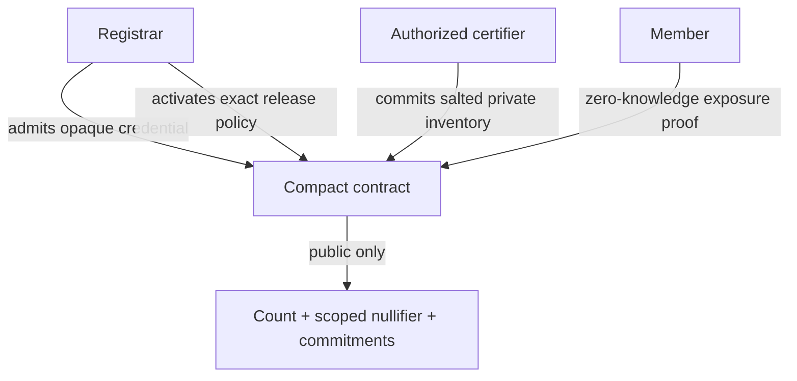

# CommonVeil CV-005 architecture

## Purpose

CommonVeil coordinates vulnerability exposure without publishing a member identity or inventory value. CV-005 demonstrates one deliberately narrow policy: an admitted member has a certifier-originated inventory snapshot for XZ Utils 5.6.0 or 5.6.1, and can report once for CVE-2024-3094.

## Roles

| Role | Private material | Authorized action |
|---|---|---|
| Registrar | `adminSecret` | Admit opaque member credentials and register exact affected releases |
| Certifier | `certifierSecret` | Create a salted inventory commitment for an admitted credential before policy activation |
| Member | `memberSecret`, `memberSalt`, `snapshotSalt`, product/version | Prove the certified snapshot matches an affected release |
| Observer | None | Read public counts, commitments, nullifiers, and submitted transaction IDs |

The Preprod demonstration generates all three private roles inside one browser session. Their keys are cryptographically distinct, but the demo is not evidence of organizational or device isolation.

## Contract state

Public ledger state contains:

- derived registrar and certifier keys;
- opaque admitted-member credentials;
- salted inventory commitments;
- exact affected-release commitments;
- advisory-scoped used nullifiers;
- the accepted-report counter; and
- the policy activation flag.

Raw secrets, snapshot salt, product, version, and member identity are not stored as ledger fields.

## Circuit sequence

1. `registerMember` checks the registrar secret and inserts an opaque credential.
2. `certifyInventory` checks the certifier secret, admitted credential, and open certification window, then inserts a salted inventory commitment.
3. `registerAffectedRelease` checks the registrar secret, inserts an exact advisory/product/version commitment, and closes certification.
4. `attest` proves membership, certified snapshot membership, affected-release membership, and unused advisory-scoped nullifier before incrementing `accepted`.

## Privacy and integrity properties

- Exact product/version matching is constrained inside Compact.
- A member cannot create a certified snapshot with only its membership secret.
- A snapshot cannot be certified after policy activation.
- The same member secret cannot report twice for the same advisory.
- The same member can report for a different registered advisory.
- Successful proof reveals affected-set membership, not the exact private release within that small public set.

See [threat-model.md](threat-model.md) for non-goals and residual risks.
